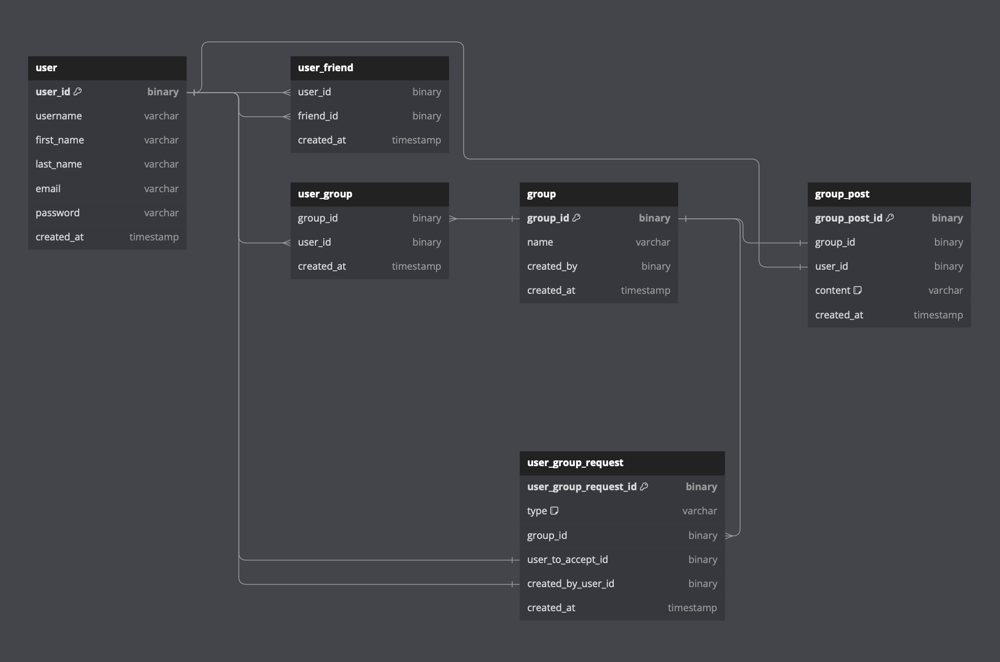

# Projekt zaliczeniowy - Programowanie aplikacji backendowych

## Prerequisite
 - `make`
 - `docker` with `docker compose`

## Setup
You can setup this application by running command
```bash
make init
```

It checks your system for required executables, setups default dev environment and runs docker containers.

## Makefile commands
In order to make this project more efficient and easy to configure on various machines, it uses `Makefile`.
Below are some of the example commands you can do using `make`:

- list all available commands
  ```bash
  make help # or just `make`
  ```
- check if your system meets requirements
   ```bash
   make check
   ```
- setup project default `.env` and build project images and run containers
  ```bash
  make init
  ```
- build containers
  ```bash
  make build 
  ```
- start containers
  ```bash
  make start
  ```
- stop containers
  ```bash
  make stop
  ```

## Database diagram

